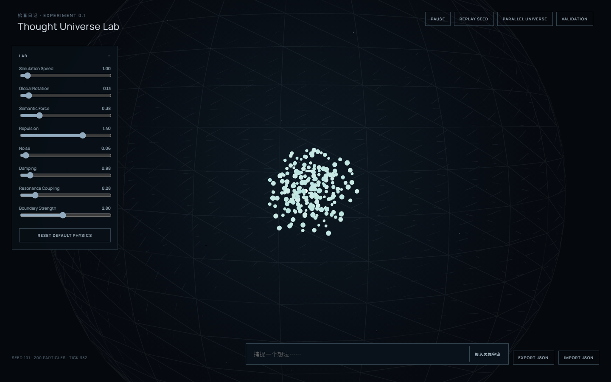

# 拾音日记 · Thought Universe Lab

> Don't encode the answer. Encode the world.

一个不预编码分类答案的思想粒子实验。200 条中文碎片在有限球体内受连续语义力、排斥、边界、旋转、阻尼、种子噪声与可学习耦合影响。



## 这是什么

这是一个用于验证自组织思想结构的实验原型，而不是笔记分类器或预先排好的 3D 星图。语义只贡献连续作用力，不决定分类、合并或最终位置；相同规则配合不同 Seed，允许产生不同但受约束的演化历史。

## 已实现

- 200 个持续运动的思想粒子与球体边界
- Web Worker 中的语义力、排斥、旋转、阻尼、噪声与共振耦合
- 实时投入新思想并观察旧世界被扰动
- 粒子检查器、历史轨迹、实验参数与 Seed 重放
- Parallel Universe、只读 Observer 和 Validation 页面
- JSON 导入导出与可复现测试

## 本地运行

```bash
npm install
npm run dev
```

验证：`npm run test` 与 `npm run build`。浏览器打开 Vite 地址，`#/validation` 是只读验证仪表板。语义默认使用即时可运行的 Mock Provider；`LocalEmbeddingProvider` 会在安装 `@huggingface/transformers` 后按需加载本地模型，不需要 API Key。

## 实验边界

当前结果证明模拟可复现、保持有限且能持续运动，但尚不能证明共振模型比普通语义聚集更有意义。长期 A/B 批量实验、1000 粒子性能和正式视觉 QA 仍是下一阶段工作。
